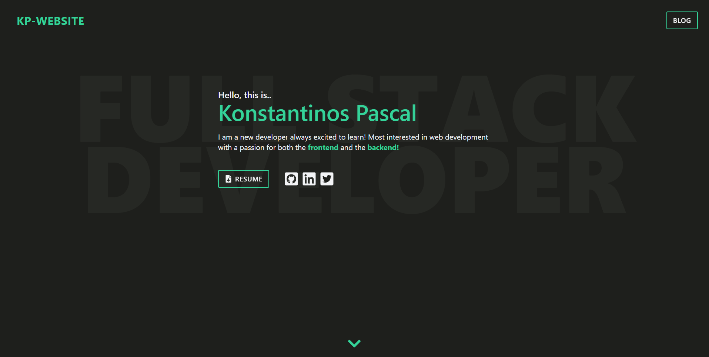
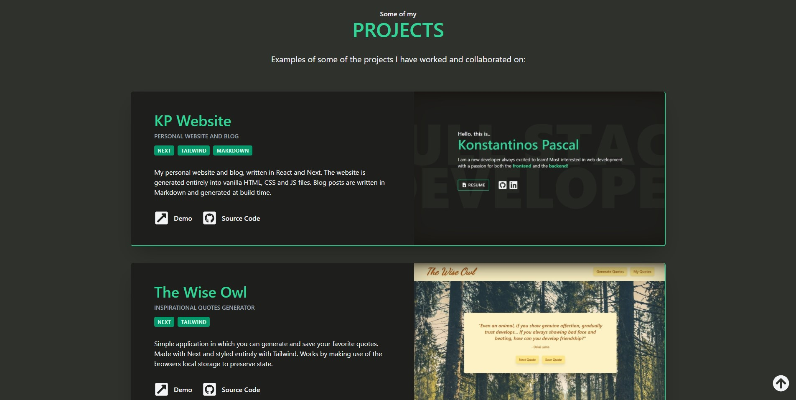
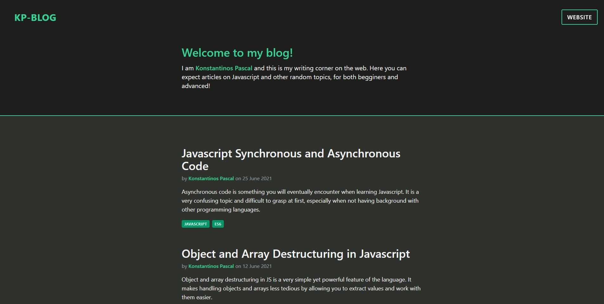
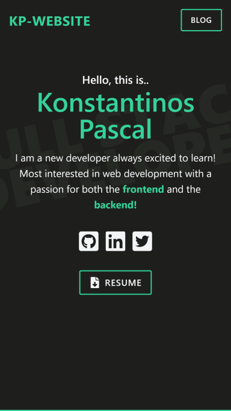
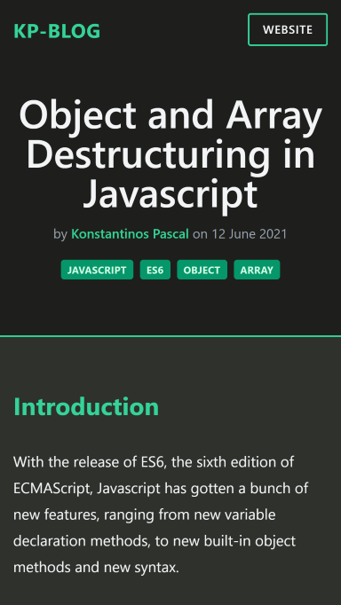

<h1 align="center">
  KP Website & Blog
  <br>
</h1>

<h4 align="center">My personal website and blog where I present myself, my work and write blog articles.</h4>

<p align="center">
  <a href="#gallery">Gallery</a> •
  <a href="#key-features">Key Features</a> •
  <a href="#how-to-use">How To Use</a> •
  <a href="#technologies">Technologies</a>
</p>

## Gallery

### Desktop view





### Mobile view




## Key Features

-  Statically generated into HTML, CSS, JS
-  Fast load times
-  Projects and blog articles are generated dynamically
-  Easy to add, remove or edit website content

## How To Use

To clone and run this project, you'll need [Git](https://git-scm.com) and [Node.js](https://nodejs.org/en/download/) (which comes with [npm](http://npmjs.com)) installed on your computer. From your command line:

```bash
# Clone this repository
$ git clone https://github.com/konstapascal/kp-website-v1

# Go into the repository
$ cd kp-website-v1

# Install dependencies
$ npm install

# Run the app
$ npm run dev
```

Note: If you're using Linux Bash for Windows, [see this guide](https://www.howtogeek.com/261575/how-to-run-graphical-linux-desktop-applications-from-windows-10s-bash-shell/) or use `node` from the command prompt.

## Technologies

This software uses the following technologies:

-  [Next JS](https://nextjs.org/)
-  [Tailwind CSS](https://tailwindcss.com/)
-  [Gray Matter](https://www.npmjs.com/package/gray-matter/v/1.2.3)
-  [Windups](https://windups.gwil.co/)

---

> [konstapascal.dev](https://konstapascal.dev) &nbsp;&middot;&nbsp;
> GitHub [@konstapascal](https://github.com/konstapascal) &nbsp;&middot;&nbsp;
> Twitter [@konstapascal](https://twitter.com/konstapascal)
